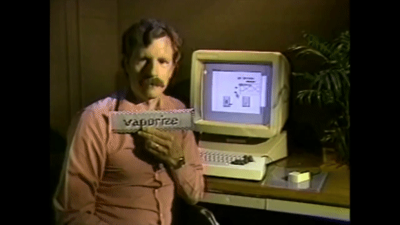

I was astonished by the mode of interacting in Self's [Morphic environment](https://handbook.selflanguage.org/2017.1/morphic.html), demonstrated in [Self: The Movie;](https://www.youtube.com/watch?v=Ox5P7QyL774).

You create a green, empty "morph" on a 2D plane, and then right-click it to open a context menu [[theory.interaction-semantics]], where you can assign behavior:

You can decompose any piece of content and rearrange it, [[theory.bricolage]]-style.

It's even realtime multiplayer in the local network!

What does this kind of environment look like if implemented today? GToolkit is cool. SqueakJS is cool. Figma for Smalltalk!?

What if the morphs were more jelly/[[metaball|theory.metaballs]]-like?

Programming in 2D is only making a comeback recently (eg some of the projects in [[projects.linear-algebra-spreadsheet]] like Paul Shen's)

([Systems with JT](https://www.youtube.com/watch?v=CCx6Nj_Hr1g). BTW [his channel](https://www.youtube.com/user/giard321/featured) has some great "OS Let's Plays")

<blockquote class="twitter-tweet">
also turns me off in many HCI prototypes I&#39;ve seen, and in the old-school Smalltalk browser UI. feels very buttons and menus world, very un-wiggly
&mdash; Omar Rizwan (@rsnous) <a href="https://twitter.com/rsnous/status/1372694522669330437?ref_src=twsrc%5Etfw">March 18, 2021</a></blockquote> 

Another system by Randall Smith is [Alternate Reality Kit](https://www.youtube.com/watch?v=I9LZ6TnSP40)

Related: [[projects.system-archaeology]]
