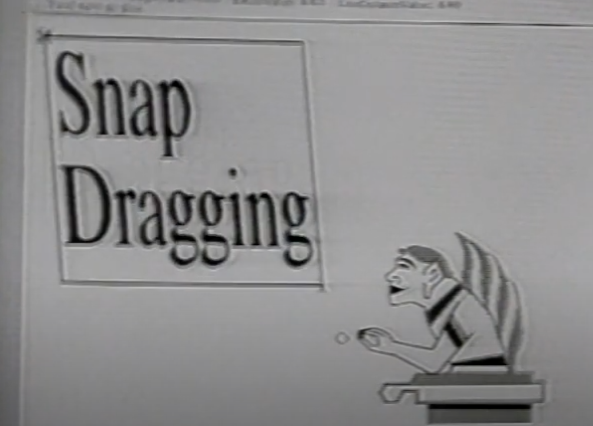
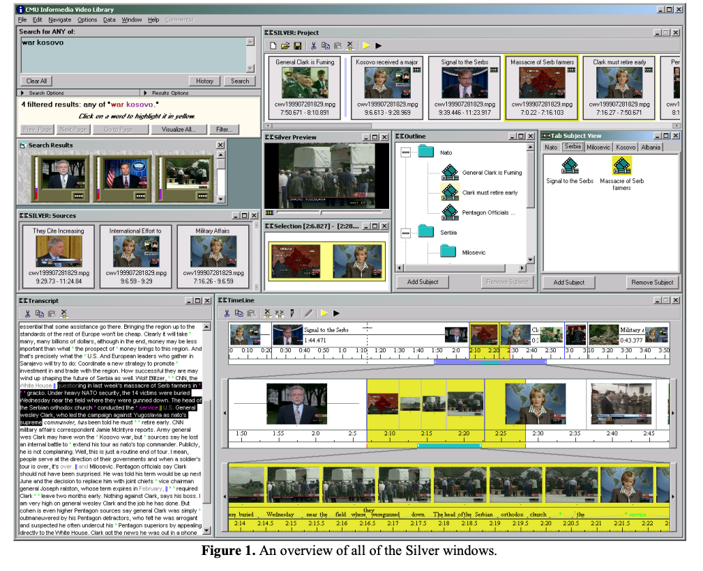
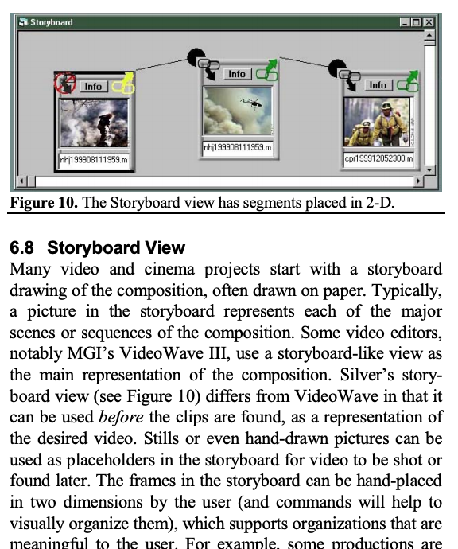
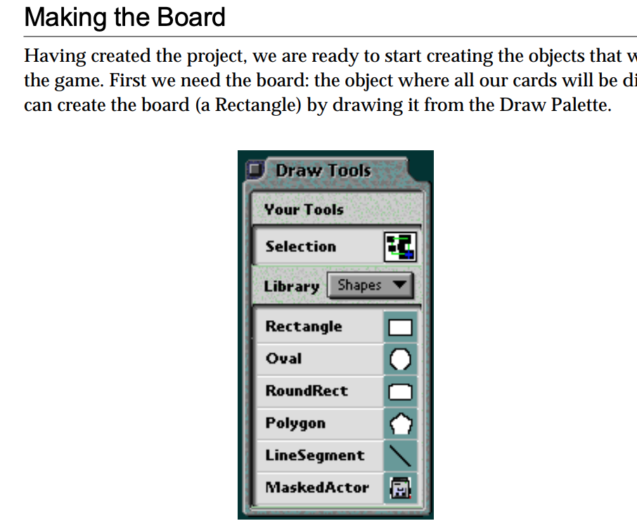
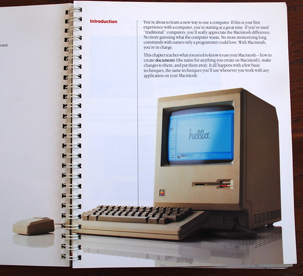
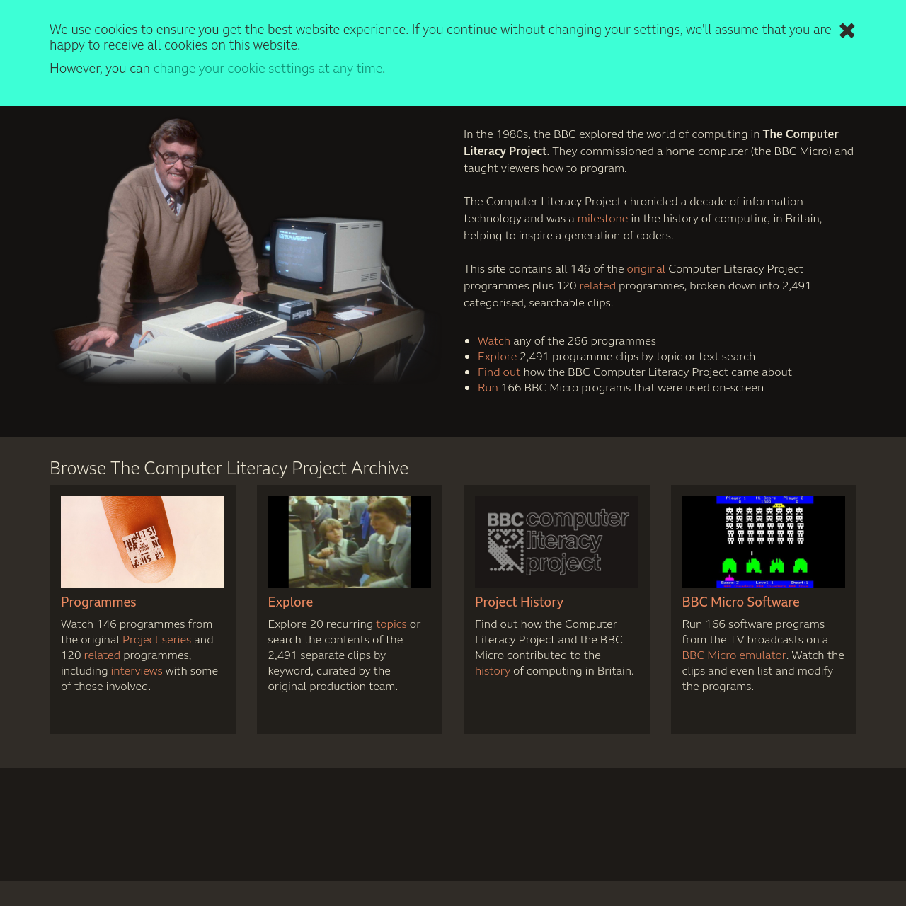
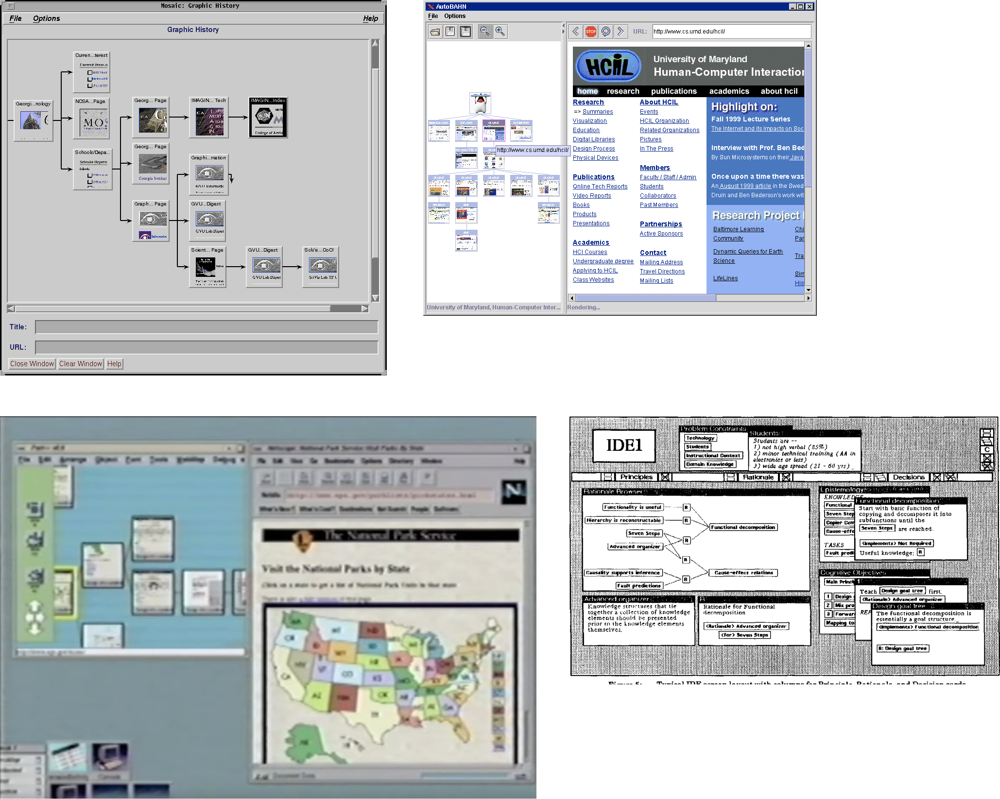

Old authoring systems have a more holistic/comfy feel because they _were_ the system, not the app.

Comparative archaeology. What's easier or harder to do? What's the texture?

**Let's explore these systems together. Let's make things in them. Let's talk about how they _feel_ to use, and how they make you feel.**

**These are usually not text based.** If they are, they have some sort of deep runtime that can be examined live.

<blockquote class="twitter-tweet">
Growing up within a worldview of &quot;apps&quot; and &quot;dev tools&quot; constrains people to see everything in those terms. It can take tremendous unlearning to even be able to /see/ an &quot;authoring is always on&quot; system for what it is. <a href="https://t.co/WJhh5OR44B">https://t.co/WJhh5OR44B</a>
&mdash; Bret Victor (@worrydream) <a href="https://twitter.com/worrydream/status/1036667880778223617?ref_src=twsrc%5Etfw">September 3, 2018</a></blockquote> 

<blockquote class="twitter-tweet">
It&#39;s cool to read about influential old software like Sketchpad but also sad that often they&#39;ve been lost to the sands of time and so we can&#39;t play with them.
&mdash; yoshiki (@yoshikischmitz) <a href="https://twitter.com/yoshikischmitz/status/1274957057884450818?ref_src=twsrc%5Etfw">June 22, 2020</a></blockquote> 

<blockquote class="twitter-tweet">
when talking about systems (OSes, PLs, games, applications), I think reading about them and their history is somewhat overrated, and actually _using_ / playing with them is underrated  (although finding a thing to use them for is often hard)
&mdash; Omar Rizwan (@rsnous) <a href="https://twitter.com/rsnous/status/1290203117649162240?ref_src=twsrc%5Etfw">August 3, 2020</a></blockquote> 

benchmarks: todo list etc

## Collection

Most of these, I later discovered, are a mere subset of Jonathan Edwards' formidable [Gallery of programmer interfaces](https://docs.google.com/presentation/d/1MD-CgzODFWzdpnYXr8bEgysfDmb8PDV6iCAjH5JIvaI/edit) ([pdf](../assets/programmer-interfaces.pdf))

- Emacs and all its "do everything" insanity
  - org-mode
- Symbolics Lisp
- AgentSheets/AgentCubes
- [Oney's InterState](https://joelbrandt.com/publications/oney_uist2014_interstate.pdf)
- [Tinker PBD for Lisp](https://web.media.mit.edu/~lieber/Lieberary/Tinker/Tinker.html)
- TouchDevelop (2011)
- TouchDesigner
- [Smalltalk Zoo](https://smalltalkzoo.thechm.org/)
- [Squeak](https://squeak.js.org/)
  - Early Scratch?
  - Berkeley Snap!
- [ToonTalk](http://www.toontalk.com/)
- Etoys
- [Self](https://selflanguage.org/)
- Forms/3
- Hypercard
- GRAIL

- [Apple Dylan](https://opendylan.org/history/apple-dylan/screenshots/)

- https://en.wikipedia.org/wiki/Genera_(operating_system)

- [HyperTIES](http://www.cs.umd.edu/hcil/hyperties/)

- [Plan9](https://merveilles.town/@neauoire/104717468496151278)

- 

- [IRIS Intermedia System](https://vimeo.com/channels/190946/20662680)

- [NLS Hyperscope](http://codinginparadise.org/ebooks/html/blog/hyperscope_screencast.html)

- [JUNO-2](http://citeseerx.ist.psu.edu/viewdoc/summary?doi=10.1.1.37.7482)
- Brad retrospective systems

- [Cedar, Mesa, Tioga](https://www.youtube.com/watch?v=z_dt7NG38V4)

- https://www.semanticscholar.org/paper/Creating-highly-interactive-and-graphical-user-by-Myers-Buxton/d064519e4be2b1c1fe9c3b3689b9fbff99187fca

  - [Cedar Glossary](http://www.bitsavers.org/pdf/xerox/parc/cedar/Cedar_7.0/02_A_Glossary_of_Terms_Subsystems_Directories_and_Files_May1987.pdf)

    

- [Gargoyle](https://www.youtube.com/watch?v=f0KqT3J67Vw)

  
  
  

- [The Silver Project](https://www.cs.cmu.edu/afs/cs.cmu.edu/project/silver/www/publications.html)

- [Chorus](http://www.chorus-home.org/) (ok, 2015)

- Subtext

- CDG/HARC

- Borning's ThingLab

- Goldberg's SimKit

- Alternate Reality Kit

  

- [Fabrik](http://sp.cmc.msu.ru/courses/smalltalk/fabrik/Fabrik.html)

- [Lively Web](https://lively-web.org/) (not dead yet!)

- [STEPS](http://www.vpri.org/pdf/tr2012001_steps.pdf)

- Xanadu/Zipper?

- [Aardappel](http://strlen.com/aardappel-language/)

- [Bounce](https://donhopkins.medium.com/bounce-stuff-8310551a96e3)

- [Whyline](https://www.cs.cmu.edu/~NatProg/whyline.html) (2005)

- [Boxer](https://web.media.mit.edu/~mres/papers/boxer.pdf)

- [Alice Pascal](https://www.templetons.com/brad/alice.html)

- Kansas https://web.media.mit.edu/~lieber/Lieberary/Softviz/CACM-Debugging/Kansas/Kansas.html

- https://www.semanticscholar.org/paper/Pygmalion%3A-a-creative-programming-environment.-Smith/0b6d3a09caf68a6ad0c04fa35698e13bcd6bbcd5

- [Apple SK8](http://old.macintosh.garden/manuals/SK8_0.9_User_Guide.pdf)
- [John Pane's HANDS](https://john.pane.net/research.html)

([Forms/3](https://pdfs.semanticscholar.org/a074/a04c61f097ee9ad13f9061aee95d1dd0c01f.pdf))

## Misc

<https://macintoshgarden.org/apps/science-math?page=2>

Would it be on Hyperlink.academy?

- [Yoshiki Ohshima's VPRI Archive](https://tinlizzie.org/IA/index.php/Intelligent_Archive) and [channel](https://www.youtube.com/channel/UCkdJ2NwjI8LcgyvfU7PyaVA)

- [**Archaeology of CAD**](http://dcardo.com/projects/archaeology_of_cad/index.html)

- [List of Fantasy Consoles](https://paladin-t.github.io/fantasy/index)

- [Why Hypercard Had to Die](http://www.loper-os.org/?p=568)

- [Byte Magazine Volume 06 Number 08 - Smalltalk](https://archive.org/details/byte-magazine-1981-08)

- [JOY LISI RANKIN: A PEOPLE'S HISTORY OF COMPUTING IN THE UNITED STATES](https://youtu.be/eEU9cwSzaBM?t=1895) (via Yoshiki Schmitz)

- [Kernel Perspective on Twitter](https://twitter.com/unix_byte) finds some great stuff.
  

- [Thoughts on (and pics of) the original Macintosh User Manual](https://www.peterme.com/2007/08/27/thoughts-on-and-pics-of-the-original-macintosh-user-manual/)

- [Hypercard Poetry (Hyperpoems)](https://twitter.com/mkirschenbaum/status/1301898638994571266?s=19)

- [Eazel Desktop Environment](https://web.archive.org/web/20000510014027/http://www.eazel.com:80/)
  

- [BBC Computer Literacy Project](https://clp.bbcrewind.co.uk/) (broken link?)

- [Momenta Smalltalk Tablet](http://kamranelahian.com/project/momenta/)

- [Computer Utopias](http://chrisnovello.com/teaching/risd/computer-utopias/)

- [VPL/Body Electric](http://www.jaronlanier.com/vpl.html)

- mind-bicycles, VPL codex, CHM

- demos, etc

- [Old CHI video list](http://www.cs.umd.edu/hcil/chivideoslist/index.shtml)

- [Visual Programming Languages - Snapshots](http://blog.interfacevision.com/design/design-visual-progarmming-languages-snapshots/)

- [Lowering the Barriers to Programming](https://www.cs.cmu.edu/~caitlin/papers/NoviceProgSurvey.pdf) - Kelleher & Pausch 2003

- [Chaim Gingold - Gadget Survey](<http://chaim.io/download/Gingold%20(2017)%20Gadget%20(1)%20Survey.pdf>)

- [The Early History of Smalltalk (Kay, reprinted by Victor)](http://worrydream.com/EarlyHistoryOfSmalltalk/)

- [Jonathan Edwards - Gallery of programmer interfaces](https://docs.google.com/presentation/d/e/2PACX-1vSPuf3eQ2tlCtXAif4gEWQQU-xK8EzhiH3SIfuD7vWy7eP4NN0-KRejbec_m-GF6-f_D95OOFyyoolx/pub?start=false&loop=false&delayms=3000&slide=id.g1da0625f1b_0_56)

[ARTWare: A Component Library for Building Domain-Oriented Authoring Environments](http://citeseerx.ist.psu.edu/viewdoc/download?doi=10.1.1.445.7604&rep=rep1&type=pdf)

From Yoshiki Schmitz. Sources unknown right now.

### Recapitulating computing

<blockquote class="twitter-tweet">
Here’s the Katz’s History of Mathematics (table of contents and the cover in the tweet below). Every chapter has a bunch of exercises, where you have to show or prove or solve something using the methodologies or number systems used in the chapter. <a href="https://t.co/nRMGQoMcor">https://t.co/nRMGQoMcor</a> <a href="https://t.co/RarQQC8CBQ">pic.twitter.com/RarQQC8CBQ</a>
&mdash; :strawberry:Eli:herb:virtual plant maker:star2: (@logicsoup) <a href="https://twitter.com/logicsoup/status/1355941297169829888?ref_src=twsrc%5Etfw">January 31, 2021</a></blockquote> 

http://scripting.com/2021/04/04/174604.html?title=theLostAppsOfThe80s
